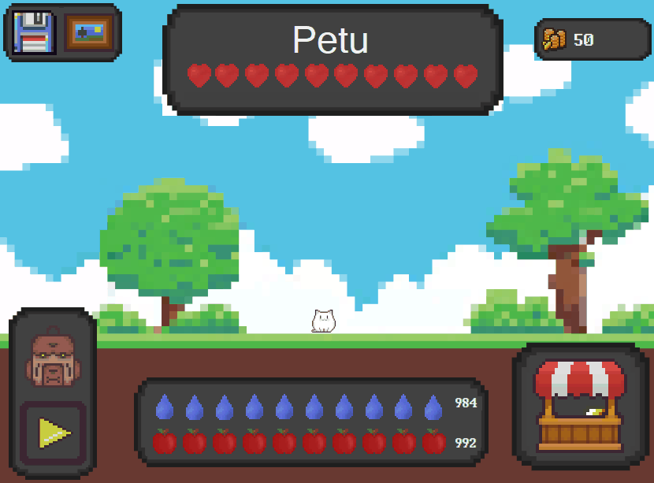
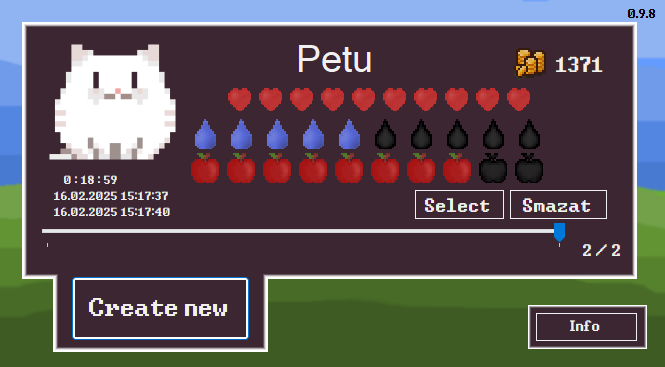
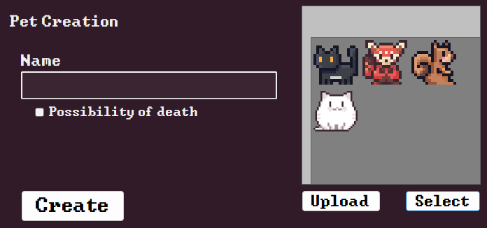
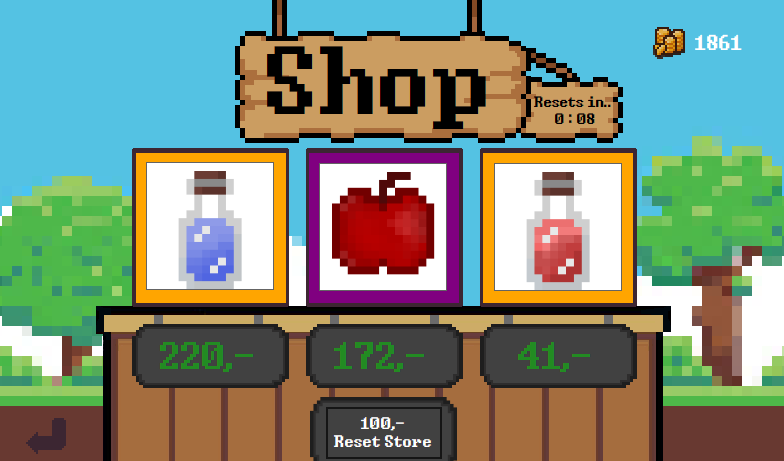
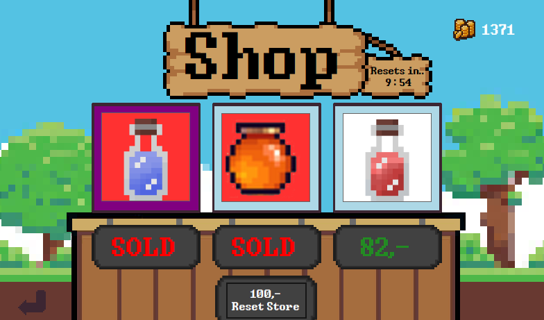
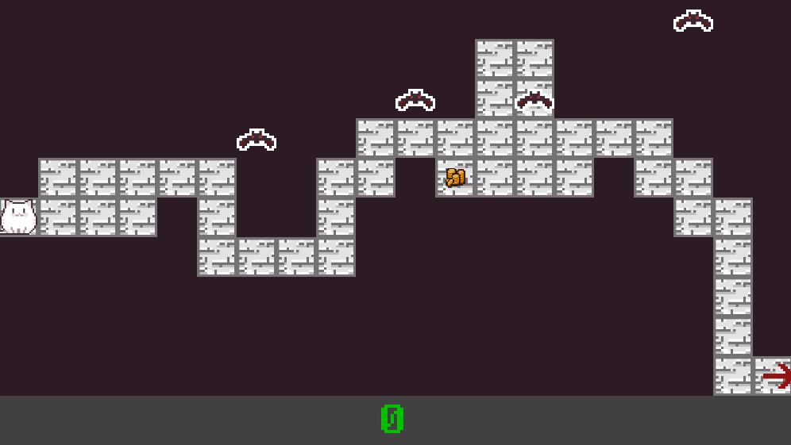
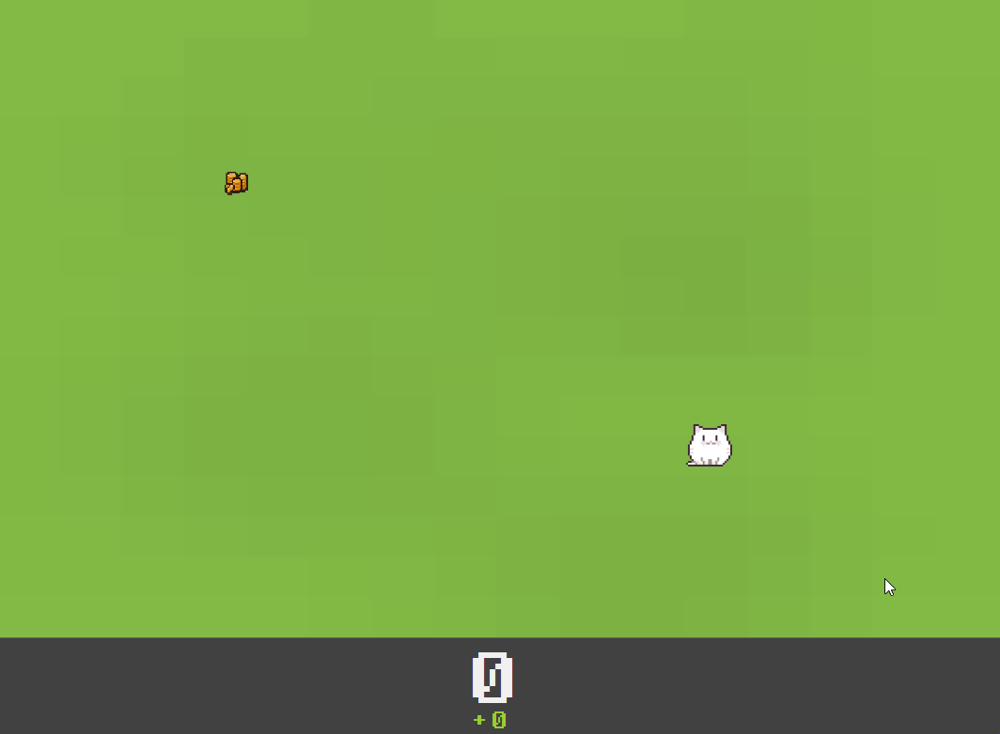

# PETU

**Petu** je hra, ve které se staráte o svého malého mazlíčka. Hrajte s ním hry, kupujte mu jídlo a celkově se snažte o jeho přežití. Hlavní myšlenkou bylo nechat hru běžet na pozadí při práci, zatímco váš mazlíček postupně roste.

## Vytvořte si svého mazlíčka

### Pojmenujte a vyberte si mazlíčka nebo nahrajte vlastního!

## Postarejte se o svého mazlíčka

### Kupujte mu jídlo

### Hrajte s ním hry

## Technologie

Jedná se o můj první větší projekt v **C#**, do kterého jsem vložil spoustu času. Hra běží na **Windows Forms**.
